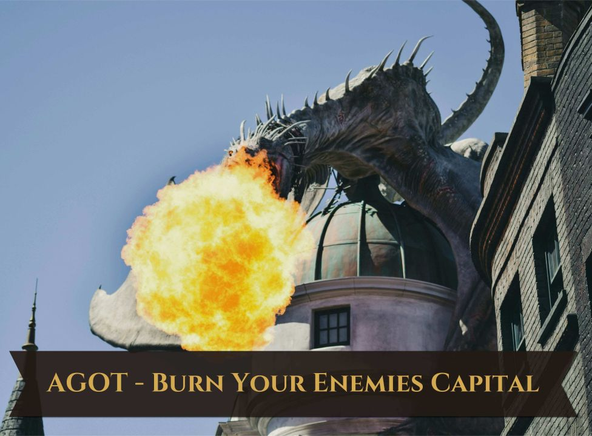

# AGOT - Burn Your Enemies Capital

Aegon the Conqueror destroyed Harrenhal with fire, if your dragon is large enough so can you!

# Change Notes

Change Notes (v1.2.1):
New: Dragon Duels — a defended capital (a dragonrider with a living dragon in the target's court) now triggers real AGOT dragon-vs-dragon combat before the raid can proceed, instead of just blocking the interaction outright. Multiple defenders are fought one at a time
New: untamed dragons caught in a burning capital now flee and go feral instead of dying alongside the rest of the court
New: Skull Trophy artifact — killing the target ruler can leave behind their skull as a masterwork trophy, with a follow-up event letting you keep or destroy it
New: the AI can now use this interaction (previously player-only), weighing personality traits, dread, and whether the odds favor them (Game rules)
New: you no longer need to already be rivals with your target, any valid landed ruler is fair game
New: "Tried to Kill Me" opinion penalty if a target you raided tries to have you murdered in revenge
New: game rules to customize the mod, raid cooldown length (short/normal/long/none), whether the AI can use the interaction, whether reducing a capital to ruins destroys its artifacts, and how dragon duels are handled (off/fight everyone/fight only the strongest)
New: more varied event art, distinct backgrounds and portraits across the raid's events instead of reusing the same two
Fixed: a rare crash when the raid's opinion penalties tried to apply to your own character
Fixed: a duel that kills the target ruler now correctly re-checks their heir/successor so the capital's courtiers and artifacts are still affected, instead of silently doing nothing
Fixed: several trait, tooltip, and localization display issues; file encoding corrected to prevent load errors